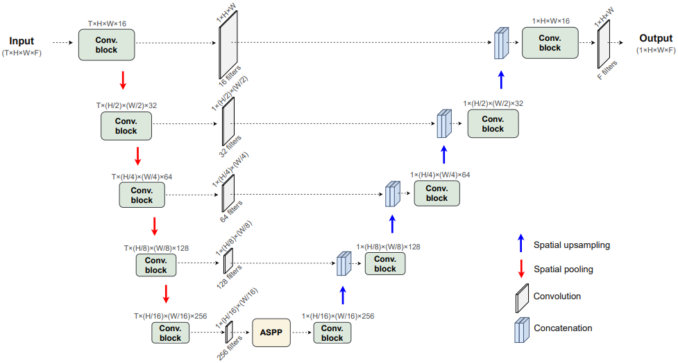
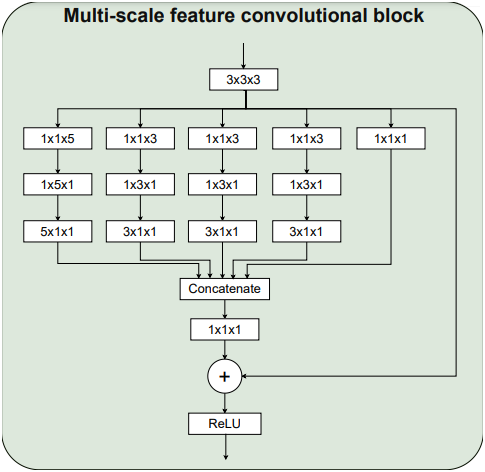
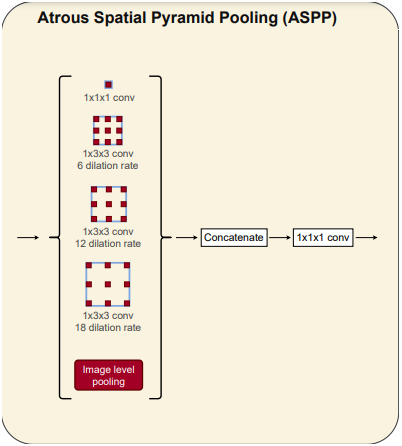

Broad-UNet: Multi-scale feature learning for nowcasting tasks
========

The official code of the following paper: https://arxiv.org/abs/2102.06442 

Results
-----
Some results for the different nowcasting tasks

+------------------------------------------+------------------------------------------------------------------------------------+
|       Task                               | Actual  Vs    Prediction                                                           |
+==========================================+====================================================================================+
| Precipitation prediction (30 mins ahead) |.. figure:: figures/ExampleRainPrediction20dataset-1.png                            | 
+------------------------------------------+------------------------------------------------------------------------------------+
| Precipitation prediction (30 mins ahead) |.. figure:: figures/ExampleRainPrediction50dataset-1.png                            |
+------------------------------------------+------------------------------------------------------------------------------------+
| Cloud cover prediction (30 mins ahead)   |.. figure:: figures/ExampleCloud30minsAhead-1.png                                   |
+------------------------------------------+------------------------------------------------------------------------------------+
| Cloud cover prediction (90 mins ahead)   |.. figure:: figures/ExampleCloud90minsAhead-1.png                                   | 
+------------------------------------------+------------------------------------------------------------------------------------+

Installation
-----

The required modules can be installed  via:

.. code:: bash

    pip install -r requirements.txt
    
Quick Start
~~~~~~~~~~~
Depending on the nowcasting task to be performed, the models can be trained running:

.. code:: bash

    python training_clouds_data.py 
    
or 

.. code:: bash

    python training_precipitation_data.py 

To evaluate the models and visualize some predictions, please run:

.. code:: bash

    python evaluation_and_predictions_clouds.py 
    
or 

.. code:: bash

    python evaluation_and_predictions_precipitation.py 

Scripts
-----

- The scripts contain the models, the generators, the training files and evaluation files.

Broad-UNet architecture
-----

  
Data and pretrained models
-----

In order to download the data or any of the trained models, please email to the following addresses:

j.garciafernandez@student.maastrichtuniversity.nl

siamak.mehrkanoon@maastrichtuniversity.nl

The data must be downloaded and unzipped inside the 'dataset_clouds/' or 'dataset_precipitation' directories as indicated in the txt files inside them.

Citation
-----

If you use our data and code, please cite the paper using the following bibtex reference:

.. code:: bibtex

    @misc{fernandez2021broadunet,
          title={Broad-UNet: Multi-scale feature learning for nowcasting tasks}, 
          author={Jesus Garcia Fernandez and Siamak Mehrkanoon},
          year={2021},
          eprint={2102.06442},
          archivePrefix={arXiv},
          primaryClass={cs.LG}
    }

